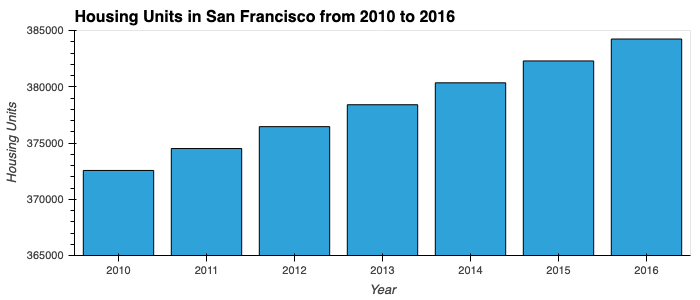
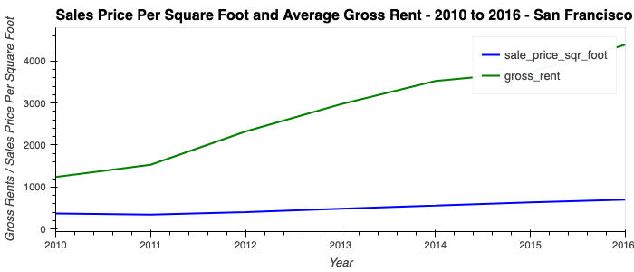
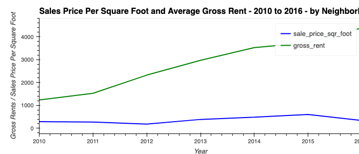
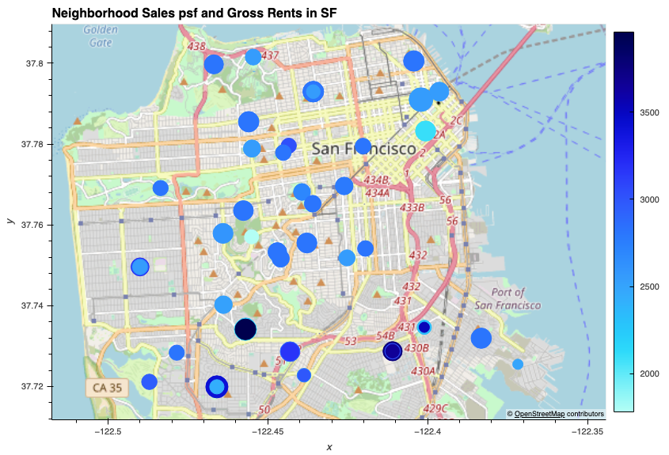
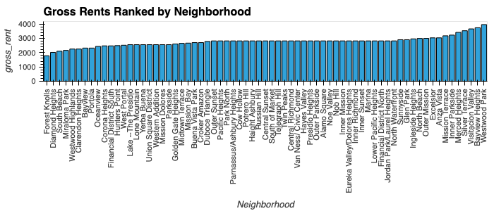
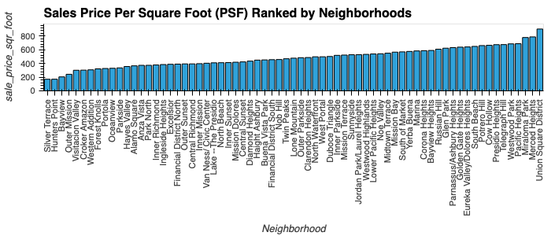
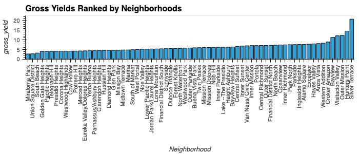
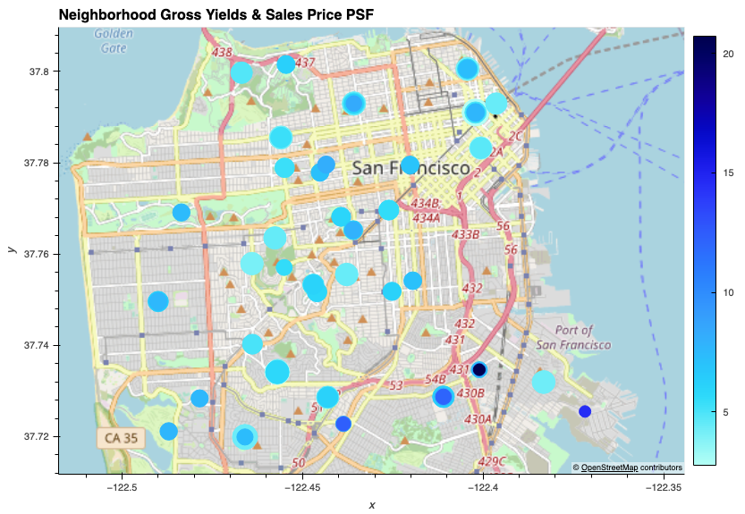

# San Francisco Real Estate Market Analysis

## Housing Unit Sales per Year

* The overall trend is positive, sales have grown 3.1% over the last 6 years from 372,560 units to 384,242. This is a fairly slow growth rate over this time period.

---
## Average Sales Price PSF and Gross Rents

* 2011 experienced a drop in price per square foot compared to 2010. Since 2011 it's been increasing every year.  Also the growth rate in rents has been faster than the growth rate in sales price per square foot which means income yields on rental properties is getting better which means SF rental real estate is becoming a higher yielding more valuable asset.

---
## Average Sales Price PSF by Neighborhood

* The average sales price per square foot for Anza Vista is down in 2016 from 2012. The price dropped from 344.49 to 88.40, that is a 74% drop in price per square foot.

---
## Summary Map of Metrics by Neighborhood

* Highest gross rent: Westwood Park. Highest sale price per square foot: Union Square District.

* Rental income growth compares favorably to sale price growth, rental income in SF grew from 1,239 in 2010 to 4,390 in 2016 which represents 254% growth in 6 years. Sale price per square foot grew from 369 in 2010 to 697 in 2016 which equals 88% growth over the same time period. This tells me gross income yields on real estate grew faster than the cost of real estate which is a positive investment trend.

---
## Ranking of Key Decision Metrics by Neighborhood

* Gross yield per investment is a good way to measure which neighborhood has the most income potential if rental income is the priority objective for this real estate investment.  

* In this scenario, Silver Terrace at 20.7% yield, Hunters Point at 14.6% yield and Outer Mission at 12.4% yield are the best neighborhoods to research further for investment purposes.

* Keys research issues are why are these yields so high?  Any investment risk issues that need to be investigated further?  Is the higher yields worth the investment?  Do assets appreciate in these neighborhoods?

* The dataset provided seems to have some sales price psf information missing for these neighborhoods.

---
## Summary Conclusion

* I'm not fan of a click buy and rent strategy, as a real estate investor myself as its easy to hide material asset issues and surrounding neighborhood issues that impact rent rates and property value if the buyer is just looking at photos online and has no concept of the physical area they're investing in because they have never seen the area.

* I would never invest what is probably equal to $1-3 MM in an asset just through online photos without seeing the area and asset first, the risks are too great to buy based on a few photos online. You also have to do due diligence on physical asset issues such as plumbing, electrical, roof and other major systems/structural issues prior to purchasing an asset so a one click and buy model does not work for me.

* What would work for me would include videos, drone footage video and aerial photos for the whole area plus a local agent on the ground to verify all the asset information along with physical checks from plumbers, electricians and other trades on the ground prior to purchase without me seeing the physical asset. So a click and buy strategy may work to get a house under contract for sale PENDING closing due diligence.
